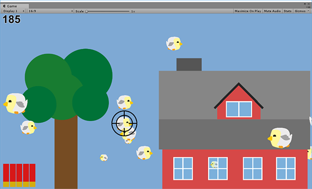

# Unity Machine Learning Environments (WIP)

This is a collection of several game simulations made with [Unity's ML Agents](https://github.com/Unity-Technologies/ml-agents). These serve as test bed for machine learning approaches such as Deep Reinforcement Learning. As this is work in progress, more distinctive environments will be added in the near future. These environments are going to focus on varying kinds of challenges:

 - Discrete/Continuous action spaces
 - State Input made of raw pixels
 - Curriculum Learning
 - Imitation Learning
 - Cooperative Agents (among other agents)
 - Competitive Agents (among other agents)
 - ...

For now, I am focusing on building interesting environments. Results, like trained models and plots, are not available currently. I will try to provide a set of working hyperparameters for each environment, so that you are able to achieve some results.
 
## Usage

All environments are based on [Unity's ML Agents](https://github.com/Unity-Technologies/ml-agents). Please follow their instructions and references to setup your Python environment.

## Available Environments
- [Basket Catch](documentation/BasketCatch.md)
	- continuous inputs
	- discrete outputs

- [Ball Labyrinth](documentation/BallLabyrinth.md)
	- continuous inputs, one camera observation
	- continuous outputs
	- curriculum learning
	- training results are pending

- [Destroy Comets](documentation/DestroyComets.md)
	- continuous inputs
	- continuous and discrete outputs
	
- [Simple Continuous Control](documentation/SimpleContinuousControl.md)
	- continuous inputs, one camera observation (optionally)
	- continuous outputs
	- training results are pending for using camera observation
	
## Potential Future Environments
Upcoming:

- Shooting Birds
	- camera observation as input
	- continuous outputs
	

----------

- [Beastly Rivals Onslaught (BRO)](https://github.com/MarcoMeter/Beastly-Rivals-Onslaught)
	- continuous or camera input
	- continuous output
	- competitive agents

- [Jenga](http://www.jenga.com/)
	- multiple camera observations as input
	- continuous output
