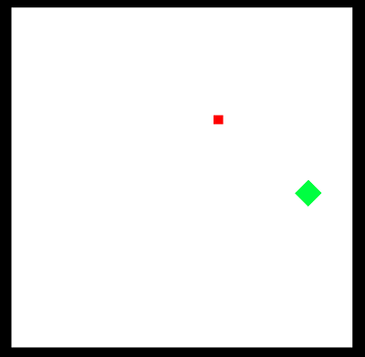
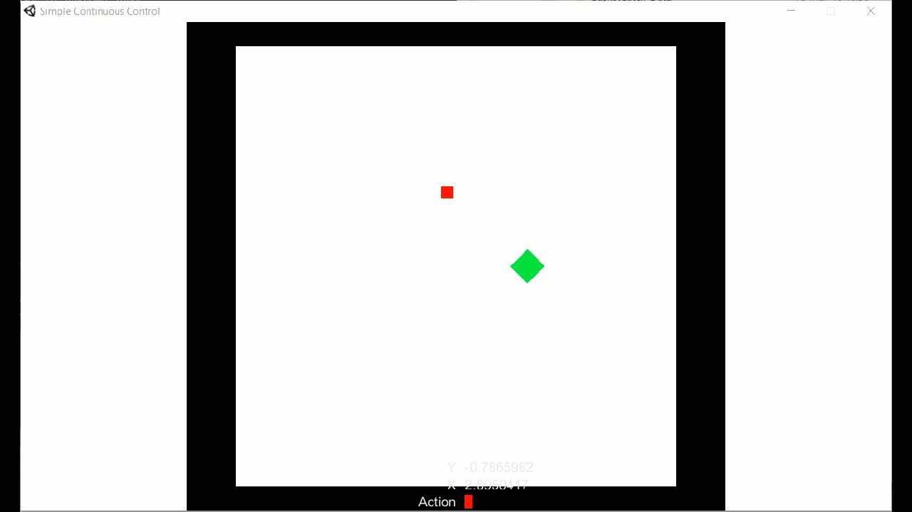

# Simple Continuous Control



## Model Details

### Environment

This environment just serves the purpose of solving fine-grained continuous actions on a low scale. The agent (red box) is supposed to move to the target (green box). The environment is constrained by walls.

### Output Actions

The agent moves continuously based on one action specifiyng the direction to move at.

### State Input

The agent receives 4 continuos inputs: agent's relative position to the target (x & y) and the agent's velocity (x & y). 

### Reward Signals

A reward of +2 is signaled to the agent for reaching its target. The agent is penalized for choosing values which exceed the range of valid angles:

```
// Penalize the agent for picking actions, which exceed the absolute threshold of one.
if(Mathf.Abs(vectorAction[0]) > 1.0f)
{
   AddReward(-0.0025f * Mathf.Abs(vectorAction[0]));
}
```

## Results

The agent is capable of solving the problem. Although, it is not choosing the perfect direction to the target, but it behaves more reasonable instead of using two actions for indicating vertial or horizontal movement. A future addition to the inputs of the agent will be a stacked visual observation and thus to introduce obstacles.

